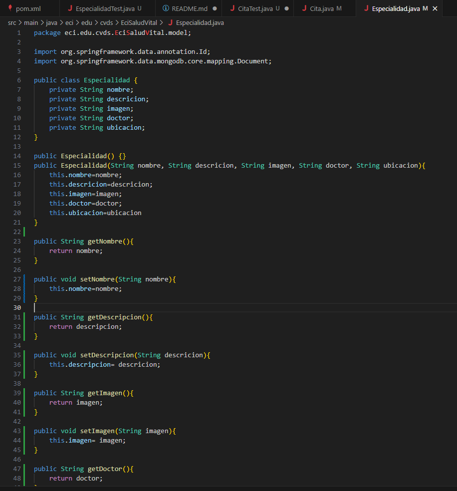
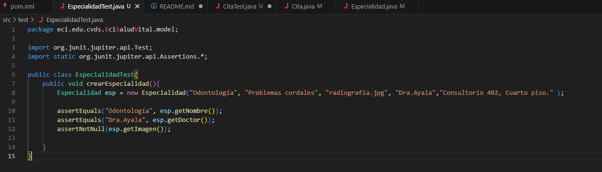

# Parcial Final Ciclos de Vida del Desarrollo de Software
## Alexandra Moreno Latorre

Para iniciar con el parcial usamos spring Initializr y generamos los archivos correspondientes.
 

Seguimos con el back en cada clase y sus pruebas unitarias correspondientes.

