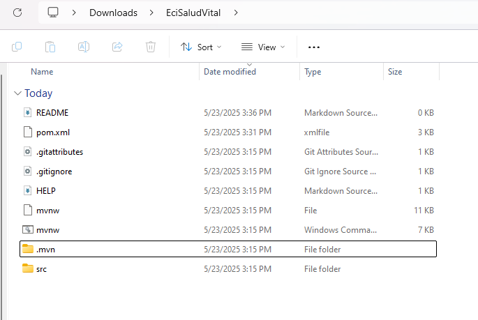
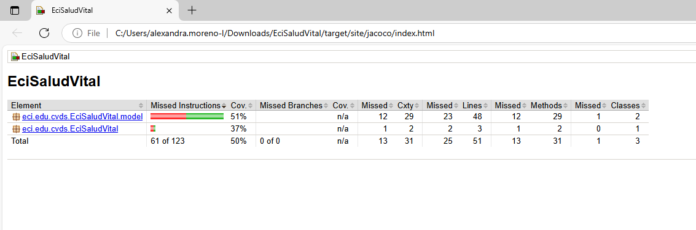
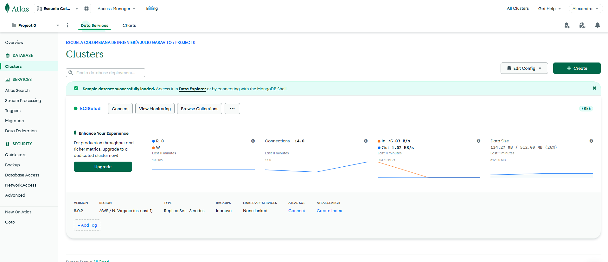

# Parcial Final Ciclos de Vida del Desarrollo de Software
## Alexandra Moreno Latorre

Para iniciar con el parcial usamos spring Initializr y generamos los archivos correspondientes.
 

Seguimos con el back en cada clase y sus pruebas unitarias correspondientes.

Hacemos la comprobación del porcentaje de jacoco.

Creamos la base de datos y la conectamos con Mongodb.
